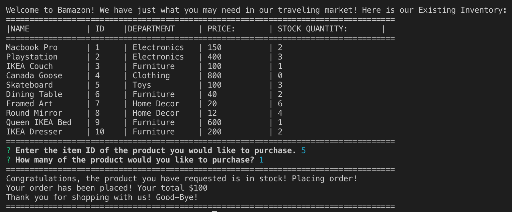
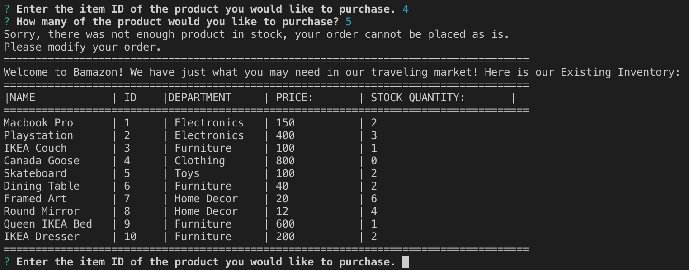

# bamazon

`Created by Zuoyi Phang`

## Introduction

### About

This application, titled 'Bamazon', is an application where a user can access an artificial shopping website as a customer. As a customer, the user can make purchases and deplete the company's inventory.

## Methods Used:

- Node.JS
- Inquirer
- MySQL

## Customer View:

`node bamazonCustomer.js`
Here you can see the store in action. Say the buyer wants to buy itemID #5. They only wanted 1.

However, the buyer decides to buy something with less stock than requested then it will prompt the buyer with a nice message to try again.

